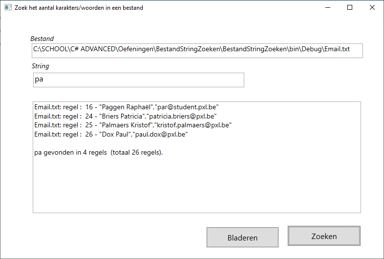
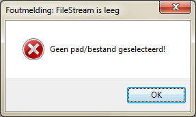
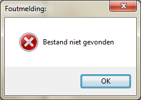
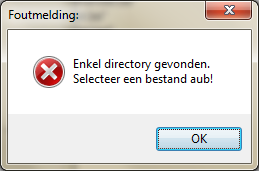

Open het tekstbestand *Email.txt* via een *OpenFileDialog* en zoek in hoeveel regels een karakter(s) voorkomt.

Voorzie een gestructureerde foutafhandeling:
-   wanneer geen bestand geselecteerd is (FileStream leeg) (ArgumentException)
-   wanneer het bestand niet gevonden kan worden (FileNotFoundException)
-   enkel een map en geen bestand geselecteerd is (UnauthorizedAccessException)
-   wanneer er een onverwachte fout zich kan voordoen (Exception)

> Geef bij elke soort fout een correct berichtenvenster.

